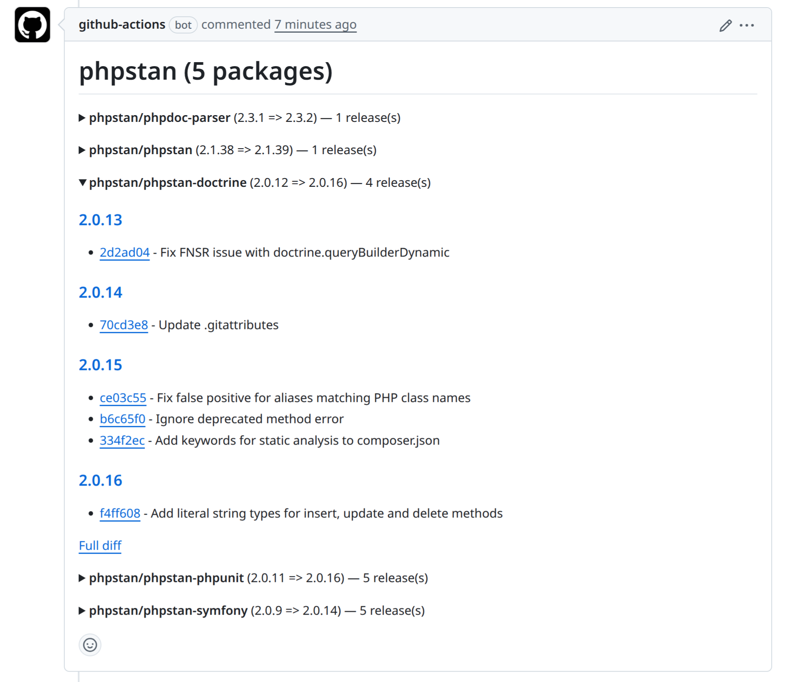

# Vendors Upgrade Report Action

A GitHub Action that generates changelog reports for upgraded Composer and Yarn packages and posts them as PR comments, grouped by vendor.

When a pull request modifies `composer.lock` or `yarn.lock`, this action:

1. Compares the lock file against the base branch
2. Fetches release notes from GitHub and changelog URLs for each upgraded package
3. Groups packages by vendor and posts one PR comment per vendor section
4. On subsequent pushes, updates existing comments (or deletes stale ones)

Symfony packages are automatically grouped and their changelogs are fetched from the `symfony/symfony` monorepo.



## Usage

```yaml
name: Vendors Upgrade Report

on:
  pull_request:
    paths:
      - composer.lock
      - '**/yarn.lock'

permissions:
  contents: read
  pull-requests: write

concurrency:
  group: vendors-upgrade-report-${{ github.event.pull_request.number }}
  cancel-in-progress: true

jobs:
  report:
    runs-on: ubuntu-latest
    steps:
      - uses: actions/checkout@v4

      - uses: tipee-sa/vendors-upgrade-report-action@v1
```

## Inputs

| Input | Description | Default |
|---|---|---|
| `token` | GitHub token for API access and posting PR comments | `${{ github.token }}` |
| `base-ref` | Git ref to compare against (e.g., `origin/main`) | PR base branch |
| `composer-lock` | Path to `composer.lock`, `"auto"` to detect from PR diff, or `"none"` to skip | `auto` |
| `yarn-lock-files` | JSON array of `yarn.lock` paths, `"auto"` to detect from PR diff, or `"none"` to skip | `auto` |

## Examples

### Only Composer

```yaml
- uses: tipee-sa/vendors-upgrade-report-action@v1
  with:
    yarn-lock-files: 'none'
```

### Only specific yarn.lock files

```yaml
- uses: tipee-sa/vendors-upgrade-report-action@v1
  with:
    composer-lock: 'none'
    yarn-lock-files: '["react/yarn.lock", "packages/ui/yarn.lock"]'
```

### Custom base ref (non-PR context)

```yaml
- uses: tipee-sa/vendors-upgrade-report-action@v1
  with:
    base-ref: 'origin/main'
```

## Requirements

- The repository must be checked out (the action fetches the base branch tip automatically).
- The workflow needs `pull-requests: write` permission to post comments.

## How it works

The action uses a PHP script that:

- Fetches package metadata from Packagist (Composer) or npm registry in parallel using `curl_multi`
- Fetches GitHub release notes in parallel, with iterative paging
- Falls back to CHANGELOG file detection when no releases are found
- Groups Symfony packages by major.minor version and uses the monorepo releases

PR comments are tagged with a content hash so the action skips re-posting when the lock file hasn't changed.
